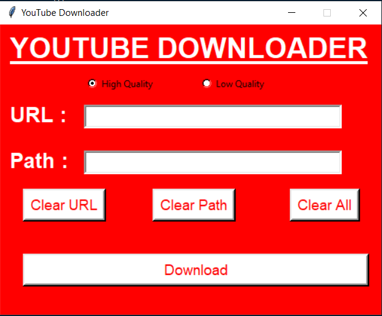

# VideoDownloader-Youtube
Desktop application to download youtube videos in local machine.

# Tech Stack
-pytube
-tkinter

# Running the application

Install the reuired modules.
*pip install -r requirements.txt*

Run *main.py* and get going!!!
